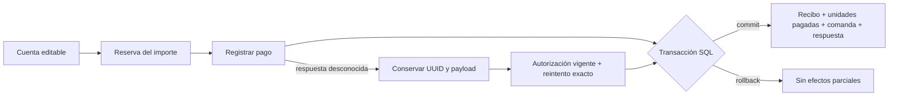

# Integridad de cobros y cuentas

Auditoría e implementación local · 3 de octubre de 2026 · Codex para la solicitud de Larios.

## Alcance y evidencia

Se revisaron las dos rutas de venta, órdenes, descuentos, división por artículos, reservas, registro y devolución, reintentos, sesiones y cierre de caja. La fuente técnica es este checkout, basado en `origin/main` `6a91c07`, con los cambios acumulativos de esta tarea. No se han publicado estos cambios.

También se consultaron Drive **02**, **04**, las últimas entradas de **05** y la [guía de terminales y recuperación de fallos de Agente de Ademir, 2 de octubre](https://docs.google.com/document/d/1j0z9GG3gg7xAQ2gWAb6A0-SUtaJ-IJlp6eY6M3d0ZuM/edit). Sus recomendaciones de integración son antecedentes; no acreditan terminales instaladas ni autorización para contratar proveedores. El producto actual registra efectivo, tarjeta externa y transferencia manualmente.

El objetivo verificable es impedir inconsistencias internas, conservar exactamente los centavos y recuperar una operación sin repetir su efecto. **No existe una garantía demostrable de cero errores en toda circunstancia.** La recepción física de efectivo, la aprobación de una terminal externa y la liquidación bancaria requieren evidencia independiente que este MVP todavía no recibe.

## Qué hacen otros POS

| Patrón documentado | Fuente primaria | Aplicación en este POS |
|---|---|---|
| Importes enteros en la unidad mínima de la moneda | [Square Money](https://developer.squareup.com/reference/square/objects/Money) | Centavos MXN enteros; límites explícitos; ninguna multiplicación de precios decimales binarios |
| Reintentar una solicitud con la misma clave; rechazar cambios bajo esa clave | [Square: idempotencia](https://developer.squareup.com/docs/build-basics/common-api-patterns/idempotency) | UUID + actor + huella del payload; efecto y respuesta aceptada en una transacción |
| Clave de idempotencia para operaciones financieras y recuperación de solicitudes interrumpidas | [Clover REST Pay: tutoriales](https://docs.clover.com/dev/docs/api-tutorials) | Comando exacto guardado antes del envío; bloqueo entre pestañas; reintento sin nuevo UUID |
| Una ausencia de respuesta puede esconder un pago procesado; consultar estado | [Adyen POS: timeouts](https://docs.adyen.com/point-of-sale/error-scenarios/pos-timeouts) | Estado pendiente recuperable; no convertir un timeout o una sesión vencida en «no cobrado» |
| Orden de descuentos/impuestos y redondeo definido | [Clover: totales](https://docs.clover.com/dev/docs/calculating-order-totals) | Política local única: descuento exacto por orden, reparto determinista, IVA incluido e histórico |

Estos patrones se adoptan como principios de integridad. No se presume compatibilidad de APIs Clover de Estados Unidos/Canadá/Europa con hardware mexicano. Tampoco se copia una política fiscal extranjera: Clover documenta distintas granularidades de impuesto; nuestro contrato conserva la política de IVA del módulo existente.

## Contrato monetario

### Unidades y límites

- Moneda operativa: MXN. Dinero en centavos enteros, nunca textos formateados como fuente del cálculo.
- Precio unitario: `0..99,999,999`; cantidad entera: `1..999`.
- Hasta 40 renglones; total de cuenta: `0..9,999,999,999` centavos.
- Descuento e IVA no negativos; descuento no supera bruto; IVA no supera el importe que lo contiene.
- Un valor cero es válido. El saldo económico cero no implica que todos los artículos estén pagados.
- La UI rechaza enteros inseguros, selecciones duplicadas y snapshots que no cumplen las igualdades. SQL vuelve a validar; el cliente no autoriza dinero.

### Igualdades

Para cada renglón:

```text
bruto = cantidad × precio unitario
total = bruto − descuento
0 ≤ IVA incluido ≤ total
0 ≤ cantidad pagada ≤ cantidad
```

Para cada cobro:

```text
total del recibo = suma de totales de sus renglones
artículos del recibo = suma de cantidades
total/descuento/IVA del intento = suma de sus snapshots
```

El IVA ya está dentro del total; no se añade de nuevo. Los datos históricos incompletos no se recalculan con las tasas actuales. Una devolución conserva el recibo original y añade un movimiento vinculado, sin editarlo. Una condonación representa un saldo sin cobrar y no se cuenta como ingreso.

### Descuentos y división

El descuento porcentual se calcula en base 10, con redondeo de mitad hacia arriba. Un descuento global se distribuye mediante restos mayores y desempate estable. La suma de las asignaciones debe ser exactamente el descuento global.

La división conserva el precio, descuento e IVA del snapshot. Para un renglón de `q` unidades, precio `u`, descuento `d`, total `t` e IVA `v`, se usan prefijos exactos:

```text
D(k) = floor(d × k / q)
T(k) = u × k − D(k)
V(k) = t = 0 ? 0 : floor(v × T(k) / t)

Cobro de n unidades tras p pagadas:
descuento = D(p+n) − D(p)
IVA       = V(p+n) − V(p)
importe   = u × n − descuento
```

BigInt en el cliente y NUMERIC en PostgreSQL evitan pérdida de precisión en productos intermedios. Al cobrar todas las unidades, los prefijos se cancelan: no se pierden ni se crean centavos. Tras el primer recibo, los importes de la cuenta quedan congelados.

## Flujo y fronteras



- En operaciones activadas, un turno abierto es requisito de registro. El cierre serializa la actividad y bloquea nuevas operaciones financieras; no se cierra con intentos pendientes.
- Una reserva preparada puede actualizarse antes del registro. La cantidad y método visibles deben coincidir con su versión confirmada antes de habilitar el botón.
- Registrar pago conserva el flujo directo solicitado. El acto de registro es una declaración del operador sobre un pago manual, no una confirmación independiente del banco.
- El backend serializa las mutaciones del negocio, valida revisión/actor/permisos y acepta todo el efecto financiero atómicamente.
- Después de respuesta perdida, se conserva el comando original. Desbloquear con una sesión vigente permite recuperarlo; revocar acceso no borra un pago posiblemente aceptado.
- Bloquear, salir o cambiar negocio/operador invalida continuaciones de la UI. Una respuesta tardía no devuelve datos, no cambia otra sesión ni elimina su recuperación.
- Un error de almacenamiento antes del envío impide enviar. El cliente no inicia silenciosamente una nueva operación para reemplazar un reintento ilegible.

## Hallazgos y correcciones

| Hallazgo reproducido | Consecuencia demostrada | Corrección |
|---|---|---|
| Seleccionar el mismo renglón dos veces en el cálculo del cliente | Preview de cuatro unidades aunque sólo quedaban tres; SQL ya rechazaba la solicitud | Kernel exacto compartido y rechazo de duplicados antes de calcular |
| Preview aceptaba snapshots monetarios imposibles | Valores plausibles, incluso con selección vacía; no se demostró corrupción persistida por API | Validación de límites, cantidad pagada y álgebra de cada snapshot |
| El cliente aceptaba una respuesta financiera sin comprobar sus igualdades | Un resultado incoherente podía mostrarse como correcto y borrar la recuperación | Validar órdenes, reservas y recibos antes de resolver la petición; tratar una respuesta inválida como resultado desconocido |
| Error de autorización durante recuperación borraba el comando | Se perdía el UUID de un pago que pudo haberse aceptado previamente | Conservar recuperación en errores de sesión/dispositivo/permisos |
| Hook reutilizado podía recibir una respuesta de la sesión anterior | Datos/reintento de otro negocio podían ser reemplazados | Alcance y generación comprobados antes/después de locks y red |
| Una respuesta tardía podía ocultar el siguiente reintento de otra pestaña | El comando seguía guardado, pero la pestaña mostraba que no había pendiente | Leer el pendiente vigente dentro del mismo bloqueo que limpia el comando anterior |
| La ruta de venta anterior conservaba continuaciones al cambiar de sesión | Una escritura pendiente podía afectar la recuperación de otro operador | Desmontaje por identidad de sesión y comprobación antes de escribir o borrar |
| El payload permanecía mutable mientras esperaba un bloqueo | La petición podía diferir del comando que inició el operador | Copia profunda síncrona antes de esperar; mismo snapshot para almacenamiento y envío |
| Una escritura privilegiada podía desalinear totales de un intento | `record_checkout` aceptaba un snapshot internamente inconsistente | Nueva migración de invariantes; comprobación del snapshot exacto y de totales |
| Historial financiero protegido sólo por convenciones de comandos | Escritura SQL interna podía reescribir importes finalizados | Guards de inmutabilidad y conservación en la base de datos |

Las dos últimas pruebas usan acceso SQL privilegiado en una base desechable. **No demuestran un exploit desde el navegador:** `app_private`, RLS, grants y autorización ya protegían esa frontera. La nueva capa previene además errores futuros de código servidor o mantenimiento.

### Organización del código

| Capa | Responsabilidad | Archivos |
|---|---|---|
| Aritmética | Límites, snapshots y prefijos exactos reutilizables | `src/lib/operational-money.ts`, `src/lib/checkout-selection.ts` |
| Frontera HTTP | Rechazar éxitos financieros incoherentes sin perder el UUID | `src/lib/financial-response.ts`, `src/lib/pos.ts` |
| Estado cliente | Identidad de sesión, almacenamiento previo, locks y recuperación | `src/features/operations/useOperations.ts`, `src/components/SaleScreen.tsx` |
| Base de datos | Snapshot, historial inmutable y grafo coherente al confirmar | Migraciones `20261003203000`, `20261003203100` y `20261003203200` |
| Evidencia repetible | Suites enfocadas, integración aislada y diagnóstico de sólo lectura | Scripts `test:integrity`, `test:integrity:integration`, `check:ledger` |

La validación de respuesta se limita al contrato monetario utilizado por el checkout. No sustituye un validador general de catálogo, informes o transporte. Los comandos guardados siguen sujetos a autorización y validación exacta en el servidor; no contienen PIN ni token del operador.

La ruta histórica `complete_sale` permanece compatible sólo para negocios que aún no han activado operaciones y para reintentos ya aceptados. Sus recibos y respuestas pasan las validaciones monetarias; el requisito de turno pertenece al recorrido de operaciones. La UI actual exige activar turnos antes de cobrar. Esta auditoría no modifica la política de compatibilidad ni agrega turnos ficticios al historial anterior.

## Paquete de verificación

```sh
# Sin navegador ni backend externo
npm run test:integrity

# Auth/Edge/Postgres reales del checkout local; exige Docker y npm run dev
npm run test:integrity:integration

# Diagnóstico agregado y de sólo lectura del backend local
npm run check:ledger

npm run lint
npm run build
```

La suite cubre conservación de centavos, descuentos, reparto, snapshots corruptos, reservas, respuesta perdida, permisos vigentes, sesiones tardías, rollback, replays y cierre. Las pruebas de PostgreSQL embebido acreditan funciones/restricciones; las de integración usan conexiones separadas para observar concurrencia real. Los fixtures son sintéticos y se limpian por negocio. Ninguna prueba requiere resetear datos de desarrollo.

### Evidencia de esta ejecución

Entorno: worktree `sale-design-8368`, rama `fix/app-ui-polish`, Node 24 y stack Docker propio `pos-dev-37692cb085`; frontend en `http://127.0.0.1:5178/`. Las tres migraciones nuevas están aplicadas en ese backend local y se conservaron los datos existentes. No se cambió un backend alojado ni se publicó el frontend.

El primer ensayo de integración real produjo **27 fallos entre 30 casos** por `42501` al confirmar la transacción. Los triggers diferidos se ejecutaban después de salir del contexto privilegiado de la RPC, y el rol de PostgREST no podía leer `app_private`. La migración adicional `20261003203200` elevó sólo los dos entrypoints de esos triggers, con dueño `postgres` y `search_path` vacío. La repetición completa pasó **30/30**. Se verificó también en PostgreSQL real que `anon`, `authenticated` y `service_role` siguen sin permiso de uso de `app_private` ni ejecución directa de esos entrypoints.

PostgreSQL embebido verifica los metadatos y los casos con cambio de rol, pero no reprodujo el fallo negativo original de COMMIT. Por eso la integración real es la evidencia de esa corrección, y no se atribuye a PGlite una capacidad que no demostró.

El diagnóstico de sólo lectura usa una única instantánea `REPEATABLE READ` y devolvió cero en sus nueve contadores. No se hicieron asientos de ajuste, redondeos correctivos ni reparaciones de datos para obtener ese resultado. Las pruebas reales limpiaron sus negocios y usuarios sintéticos.

| Comprobación final | Resultado |
|---|---|
| `npm run test:integrity` | **250/250**, 26 archivos; kernel, límites, reservas, recuperación, componentes de checkout y restricciones financieras |
| SQL completo | **103/103**, 7 archivos; esquema, permisos, reintentos, transacciones e historial |
| Componentes completos | **211/211**, 23 archivos |
| `npm run test:integrity:integration` | **30/30**, sin omisiones; Auth/Edge/PostgreSQL reales, ambas rutas de venta y conexiones separadas |
| `npm run check:ledger` | **9/9 contadores en cero**, después de la limpieza de fixtures |
| Lint, TypeScript y build | Aprobados; artefacto de producción sin acceso ni credenciales ficticias de desarrollo |
| Migraciones locales | Historial aplicado hasta `20261003203200`; las tres fuentes coinciden con los archivos usados por el stack |
| Diff | Sin errores de espacios ni cambios descartados de otros trabajos |

Las suites se solapan; sus cantidades no se suman como casos distintos. El oráculo monetario independiente comprueba más de 1.000 combinaciones de precios, cantidades, descuentos, IVA y pagos parciales, incluidos valores límite y recibos de cero centavos. Las pruebas de UI usaron componentes y transporte controlado; la integración real verificó contratos con respuestas reales. No se usó navegador ni hardware de pago para esta revisión.

## Límites que requieren integración futura

- Terminal externa: el POS no transmite ni consulta el cargo; un operador puede introducir un registro que no corresponda a dinero recibido, o cobrar externamente sin registrarlo.
- Transferencia: registrar no prueba depósito, liquidación ni ausencia de reverso posterior.
- Efectivo: el sistema calcula cambio/saldo; no cuenta los billetes físicamente.
- Conector futuro: identidad de intento y referencia durable, idempotencia del proveedor, consulta tras timeout, eventos autenticados y conciliación. No habilitarlo sólo porque la UI o una llamada de prueba funcionen.
- Privilegios de administrador: las restricciones previenen accidentes; un administrador capaz de modificar esquema puede quitar las restricciones. No se presenta como contabilidad invulnerable a control total de la base.
- Las pruebas son evidencia de los casos ejecutados, no una prueba formal de todas las entradas, hardware o fallos posibles.

La aceptación se expresa mediante invariantes y evidencia repetible, sin un sello de «100% seguro» que el producto no puede demostrar.
